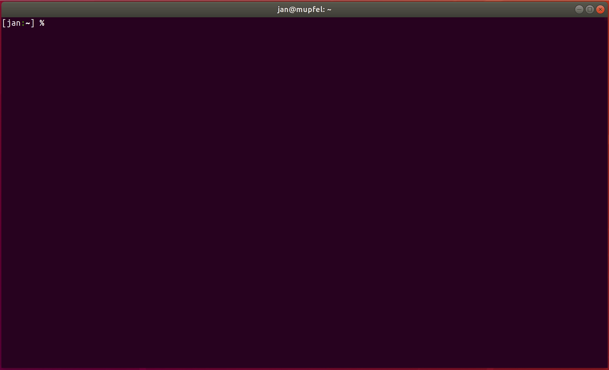

<p align="center">
  
  <h3 align="center">terradozer</h3>
  <p align="center">Terraform destroy using the state only - no *.tf files needed</p>
</p>

---
[](https://github.com/jckuester/terradozer/releases/latest)
[](/LICENSE.md)
[](https://travis-ci.org/jckuester/terradozer)
[](https://codecov.io/gh/jckuester/terradozer)
[](http://godoc.org/github.com/jckuester/terradozer)

Terradozer takes a Terraform state file as input and destroys all resources it finds in it - without needing any *.tf
files. This works currently only for resources of the Terraform AWS Provider. If you need support for any other provider,
let me know, and I will try to help.

Happy (terra)dozing!

## Example



## Features

* Nothing will be deleted without your confirmation. Terradozer always lists all resources first and then waits for
  your approval
* Using the `-force` flag (dangerous!), terradozer can run in an automated fashion without human interaction and approval,
  for example, as part of your CI pipeline
* **Planned**, if you want me to implement this, [please upvote](https://github.com/jckuester/terradozer/issues/9):
  Allow terradozer pointing directly to a state file stored in S3, i.e., `terradozer s3://path/to/terraform.tfstate`
* **Planned**, if you want me to implement this, [please upvote](https://github.com/jckuester/terradozer/issues/8):
  A `-recursive` flag to delete resources of all states found under a given directory, i.e.,
  `terradozer -recursive s3://bucket-with-states/`. This is especially helpful if
  you orchestrate Terraform modules with [Terragrunt](https://github.com/gruntwork-io/terragrunt) and store all states
  under the same directory or in the same S3 bucket. This way, a complete Terragrunt project could be cleaned up in an
  automated fashion.

## Installation

It's recommended to install a specific version of terradozer available on the
[releases page](https://github.com/jckuester/terradozer/releases).

Here is the recommended way to install terradozer v0.1.0:

```bash
# install it into ./bin/
curl -sSfL https://raw.githubusercontent.com/jckuester/terradozer/master/install.sh | sh -s v0.1.0
```

## Usage

To delete all resources in a Terraform state file:

    terradozer [flags] <path/to/terraform.tfstate>

To see all options, run `terradozer --help`. Provide credentials for the AWS account you want to destroy resources in
via the usual [environment variables](https://docs.aws.amazon.com/cli/latest/userguide/cli-configure-envvars.html), e.g.,
`AWS_PROFILE=<myaccount>` and `AWS_DEFAULT_REGION=<myregion>`.

The region information is needed as it is not stored as part of the state. Having multiple providers wit different
regions in one state file is not yet supported.
 
## How it works

Terradozer first scans a given Terraform state file (read-only) to find all resources (excluding data sources),
then downloads the necessary Terraform Provider Plugins to call the destroy function for each resource on the respective
CRUD API via GRPC (e.g., calling the Terraform AWS Provider to destroy a `aws_instance` resource).

## Tests

This section is only relevant if you want to contribute to Terradozer and therefore run the tests. Terradozer has
acceptance tests, integration tests checking against changes of behaviour in the Terraform Provider API, and of course
unit tests.

Run unit tests

    make test
    
Run acceptance and integration tests

    AWS_PROFILE=<myaccount> AWS_DEFAULT_REGION=<myregion> make test-all
